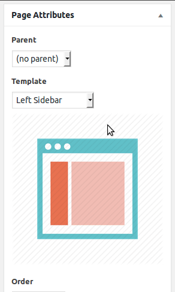
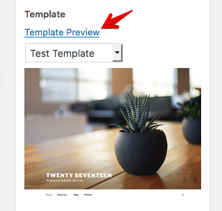

# WP Template Preview
Finally! It's here :D

Improve your theme UX by providing a preview image of your **custom page templates** of any post type. You can use this plugin as plugin obviously but if you want you can easily integrate this plugin with your theme or you can just use the class throwing the directory far away.

## How To Add Preview Image?
Along with the regular custom template header just add another header key **Preview Image**. And then pass the image source as the value of **Preview Image**. Make sure image source is relative to your theme directory. You can change the header key using filter hook `wp_template_preview_header` or you can hack the source code if you are going to tightly integrate this plugin with your theme. Please check the following code to understand the header key: value relation clearly.

```php
<?php
/**
 * Template Name: Right Sidebar
 * Preview Image: assets/images/template-preview/right-sidebar.png
 */
```

## How To Preview Your Page Applying Any Custom Page Template?
You will see a link **Template Preview** just above the page template dropdown list. Select a template from the list and click on **Template Preview** link.

## Preview In Action




## Feedback
Liked this? Then don't forget to give me a **star** :D, it'll inspire me. And if you wanna share your tought or have any idea that you wanna discuss then here I'm!

- [obiPlabon](https://fb.me/obiPlabon) on facebook
- [obiPlabon](https://twitter.com/obiPlabon) on twitter

## Contributors
- [Md Jahidul Islam](https://github.com/onetarek) - Added template preview feature.